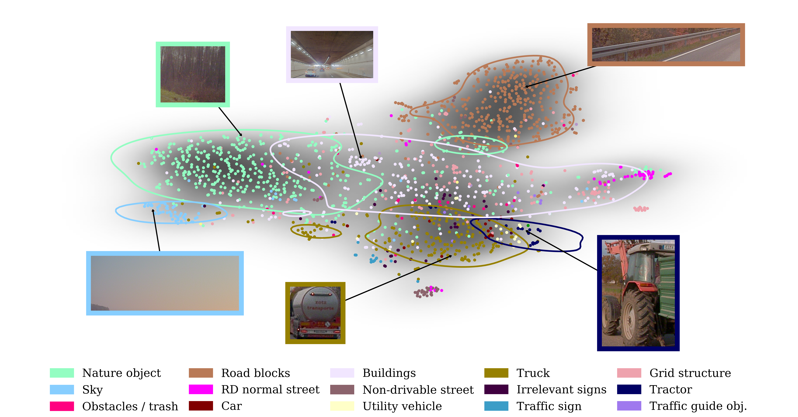

This repository supplies the code to the paper *'Detection and Retrieval of Out-of-Distribution Objects in Semantic Segmentation'*. Please have a look at the [paper](https://arxiv.org/abs/2005.06831) or our [presentation](https://youtu.be/T6rrAE47CFw).

DeepLabV3+ model and pretrained cityscapes weights are from [NVIDIA's Semantic Segmentation](
https://github.com/NVIDIA/semantic-segmentation) repository.\
The original MetaSeg Code can be found in the repository to the paper
[Prediction Error Meta Classification in Semantic Segmentation:
Detection via Aggregated Dispersion Measures of Softmax Probabilites](https://github.com/mrottmann/MetaSeg).

#### DeepLabv3+ Model and Datasets

- You can get pretrained model weights for the DeepLabv3+ architecture that we used from
[NVIDIA's Semantic Segmentation](https://github.com/NVIDIA/semantic-segmentation) repository.
- [A2D2 Dataset](https://www.audi-electronics-venture.de/aev/web/de/driving-dataset.html)
- [Cityscapes Dataset](https://www.cityscapes-dataset.com/)

#### Preliminaries

- Make sure your cloned copy is on your `PYTHONPATH`.
- Packages that we used can be found in `requirements.txt`. Demo was tested in a Python 3.7 environment.
- Change all global path definitions within `configuration.py` to suit your environment.
- Select the dataset that you want to evaluate on with the `DATASET` attribute within `configuration.py`.
- All scripts have been written utilizing [sacred](https://sacred.readthedocs.io/en/latest/index.html)
as an experiment and command line argument manager. Check out the help message with
`python3 script_name.py -h`. If you run the script as `python3 script_name.py print_config` the current parameter
configuration is displayed. They reference back to the `configuration.py` but can also be changed
on the command line using e.g. `python3 script_name.py with args.gpu=3`.

#### Scripts to run

In order to ensure that all the meta data is present you have to run the following scripts
in the depicted order. For later runs you may omit some of them as most of the results are
stored on disk.

1. The `pred_images.py` script will take the images of the dataset defined in `configuration.py`
and predict the semantic segmentation masks. Note that this step takes up the most disk space
as predictions are saved for later processing. A single image of the cityscapes dataset takes up around
185MB. The inference of the DeepLabv3+ model requires a GPU with at least 6.5 GB of memory.
2. `src/MetaSeg/main.py` computes all MetaSeg metrics and connected components on the predictions
of the semantic segmentation model.
3. (Optional) If you want to use a small neural network to predict the IoU based on the metrics
you would have to train one now with the `train_meta_nn.py` script. If you do not want to train your own meta
segmentation model we supplied a pretrained one which got trained on metrics gathered from the Deeplabv3+ model on the
cityscapes training set.
4. `compute_embeddings.py` extracts segments based on the predicted IoU and computes visual
features using common deep learning architectures pretrained on imagenet.
5. Now you can run the `discover_embedding_space.py` script which launches an interactive matplotlib
environment where you can discover the resulting embedding space. Look at the end of the readme for keyboard and mouse
commands that you can use.\
Note: As images are loaded on the fly it is best to have all the data on a local machine and also run `discover_embedding_space.py`
on your local machine. SSH tunnels should work too but might be slow because of the transmission of the image data.

#### How to add your own dataset

If you just want to infer some images without having ground truth and without writing a
PyTorch dataset class you can use the provided custom dataset class and just change the path
to your images in the `configuration.py`.\
For all other cases you have to do the following:

1. Write a [PyTorch dataset class](https://pytorch.org/docs/1.3.1/data.html?highlight=dataset#torch.utils.data.Dataset)
for your dataset. The `__getitem__` of your dataset class should return three elements in the following order:
`(image, ground_truth, path_to_image)`. If you do not have ground truth information for your data you can just return
a tensor of zeros that has the same spatial size as the image. The `__init__` method of your class should also accept the
keyword `transform` and apply it to the image data. This ensures that the correct mean and standard deviation
for normalization is applied to the data. (see `src/datasets` for examples) Additionally if you specify your own
training dataset the class has to provide the attribute `pred_mapping` containing a dictionary mapping for predicted
class ids that returns a tuple `(class_name, class_rgb_color)` with `class_name` being a string depicting the name of
the class and `class_rgb_color` being a tuple containing the RGB color for this class. RGB values should be in the range
[0, 255]. If you also want to including some ground truth information you can provide a `label_mapping` attribute which
contains a similar mapping as the `pred_mapping` attribute but for all available ground truth classes. There are
`pred_mapping` **and** `label_mapping` attributes as the set of predicted classes can differ from the total available
set of classes.

2. Update the named tuple `datasets` within the `configuration.py` file. You have to supply the name of your dataset,
the module name, the class name of your PyTorch dataset class as well as a dictionary containing optional keyword
arguments that are getting passed to the `__init__` method of your dataset (the root path to the images e.g.).
That's all you have to do. Just change the `DATASET` attribute within the `CONFIG` and run the scripts. As mentioned
earlier, if you just want to infer some images without having annotations for them you can use the already written
`custom_dataset` in `datasets` in the `configuration.py` file. Just change the root path to the directory containing
your images and run the scripts.

3. If you want to filter out specific predicted classes in the `compute_embeddings.py` script, you can define a list
`pred_class_selection` within the same file of your dataset class and list all the predicted class indices that should
be considered for further processing (see `cityscapes.py` for an example).

#### How to add your own model

In order to add a custom semantic segmentation or meta model you just have to add a new entry in the respective dictionary
within the `configuration.py` file. The first argument should be the name of your model (will be used to generate folder structure).
The second argument should be the module name, the third the class name of your model, the fourth a dictionary of keyword
arguments that is being passed to the `__init__` method of your model and the fifth argument the path to the pretrained weights,
or if they do not exist yet where the trained weights should be saved (in case you specified a meta model and train
it with the `train_meta_nn.py` script). Meta models should accept an integer as first attribute which sets the number
of input features to the network.

#### Keyboard and mouse commands

When using the `discover_embedding_space.py` script you can discover the embedding space of
predicted segments in an interactive matplotlib environment. The following commands only work
within the main scatter or nearest neighbor view.

Command | Function
-------- | ----------
Left mouse button | Shows the full image the segment originates from. The segment is marked with a red bounding box.
Middle mouse button | Show a detailed overview consisting of four panels. (top left: entropy heatmap, top right: predicted IoU, bottom left: original image with ground truth overlay, bottom right: predicted segmentation)
Right mouse button | Performs a nearest neighbor search in the embedding space. The hit scatter point or segment crop will be used as query.
Mouse wheel | Increases / decreases number of nearest neighbors showed when performing a nearest neighbor search.
Ctrl + Left / Middle mouse button | Does the same as left / middle mouse button but saves the result on the disk instead of showing it in another window.
t + Left mouse button | Does not save the whole source image but only the displayed thumbnail.
m | Cycles through available distance metrics for nearest neighbor search.
g | Colors the scatter plot with the colors of the ground truth classes.
h | Colors the scatter plot with the colors of the predicted classes.
b | Colors the scatter in a uniform blue color.
d | Shows a global gaussian kernel density estimate in the background.
c | Starts a clustering with k-means as standard algorithm. You will be asked for the number of clusters you want to compute. Typing 'elbow' will give you the opportunity to estimate the optimal number of clusters. This only works with the k-means algorithm.
\# | Cycles through all available clustering algorithms. Currently there is k-means, spectral- and agglomerative-clustering (with ward linkage) supported.

#### Citing
@inproceedings{Oberdiek2020,\
author = {Philipp Oberdiek and\
          Matthias Rottmann and\
          Gernot A. Fink},\
title = {Detection and Retrieval of Out-of-Distribution Objects in Semantic Segmentation},\
booktitle = {2020 {IEEE/CVF} Conference on Computer Vision and Pattern Recognition,\
             {CVPR} Workshops 2020, Seattle, WA, USA, June 14-19, 2020},\
pages = {1331--1340},\
publisher = {{IEEE}},\
year = {2020},\
}
